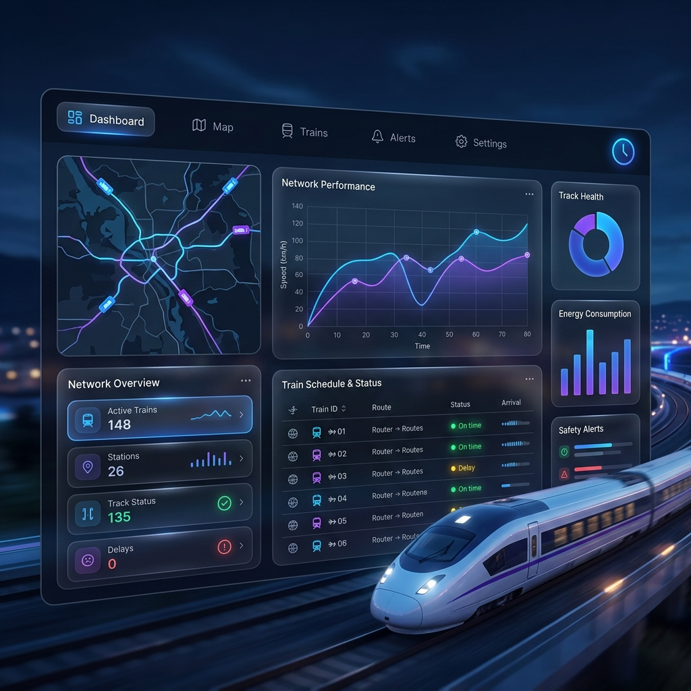
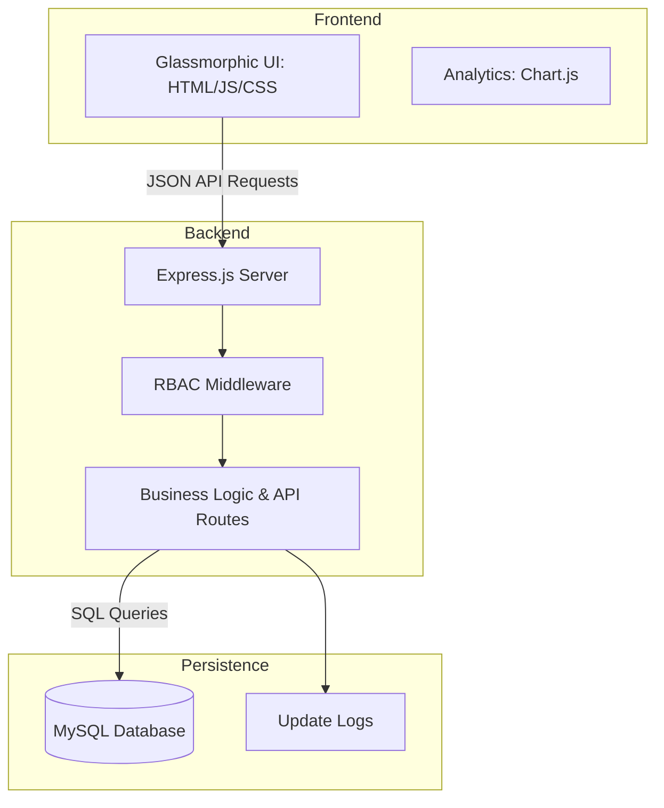

# 🚄 Railway Pro: Advanced Train Delay Management System

[](https://opensource.org/licenses/MIT)
[](https://nodejs.org/)
[](https://expressjs.com/)
[](https://www.mysql.com/)
[](#)

**Railway Pro** is a high-performance, full-stack analytics and management platform designed for modern railway operations. It provides operators and stakeholders with real-time visibility into train performance, delay trends, and operational efficiency through a sleek, glassmorphic interface.

---

## 💎 Premium Features

### 📊 Intelligent Analytics Dashboard
*   **Real-time KPIs**: Monitor On-Time Performance (OTP), Average Delay, and Fleet Volume at a glance.
*   **Visual Trend Analysis**: Interactive charts and heatmaps powered by **Chart.js** for identifying systemic delay patterns.
*   **Bottleneck Detection**: Automatically identify stations and routes with the highest frequency of significant delays.

### 🛡️ Enterprise-Grade RBAC
*   **System Administrator**: Complete control over fleet assets, station configurations, and user credentials.
*   **Station Manager**: Localized access for logging performance, updating schedules, and verifying data.
*   **Public Portal**: Secure, read-only access for passengers and general stakeholders to view live status and schedules.

### ⚙️ Operational Excellence
*   **Quick-Add Dashboard**: A streamlined interface designed for rapid data entry during peak operational hours.
*   **Automated System Logs**: Comprehensive tracking of data updates, scraping cycles, and health checks.
*   **Advanced Reporting**: One-click CSV export for offline analysis and stakeholder reporting.

---

## 🏗️ System Architecture



### 📂 Directory Structure
```bash
├── backend/            # Express.js Core
│   ├── middleware/     # Security & Session Handling
│   ├── routes/         # Modular API Endpoints (Trains, Stations, Reports)
│   ├── db.js           # Database Connection Pool
│   └── server.js       # Main Entry Point
├── database/           # Data Definitions
│   └── schema.sql      # MySQL Schema & Seed Data
└── frontend/           # Premium Interface
    ├── css/            # Glassmorphic Design System
    ├── js/             # Reactive API Logic
    ├── assets/         # High-Resolution Assets
    └── *.html          # Responsive Page Templates
```

---

## 🛠️ Technical Stack

| Category | Technology |
| :--- | :--- |
| **Frontend** | HTML5, CSS3 (Custom Design System), JavaScript (ES6+), Chart.js |
| **Backend** | Node.js, Express.js |
| **Database** | MySQL 8.0+ |
| **Security** | express-session, Custom RBAC, CORS |
| **Styling** | Vanilla CSS (Glassmorphism), Google Fonts (Inter/Roboto) |

---

## 🚀 Installation & Setup

### 1. Database Provisioning
1. Initialize your MySQL instance and create the core database:
   ```sql
   CREATE DATABASE train_delay_management_system;
   ```
2. Populate the schema and seed data:
   ```bash
   mysql -u your_user -p train_delay_management_system < database/schema.sql
   ```
3. Configure credentials in `backend/db.js` or via a `.env` file.

### 2. Environment Setup
```bash
cd backend
npm install
```

### 3. Launching the Platform
```bash
# Start in Development Mode (Auto-reload)
npm run dev

# Start in Production Mode
npm start
```
Access the application at: **[http://localhost:3000](http://localhost:3000)**

---

## 📡 REST API Reference

| Endpoint | Method | Role | Description |
| :--- | :--- | :--- | :--- |
| `/api/auth/login` | `POST` | Public | Authenticates user and initiates session |
| `/api/summary` | `GET` | Public | Aggregated KPI data for the dashboard |
| `/api/trains` | `GET/POST/PUT` | Admin | Comprehensive fleet management |
| `/api/stations` | `GET/POST` | Staff | Manage station nodes and attributes |
| `/api/delay-stats` | `GET` | Public | Detailed delay metrics per train/station |
| `/api/reports/trains`| `GET` | Staff | Generates CSV export of performance data |

---

## 🔑 Access Credentials

| Role | Username | Password |
| :--- | :--- | :--- |
| **Administrator** | `admin` | `admin123` |
| **Station Manager** | `manager` | `manager123` |
| **Public User** | `user` | `user123` |

---

## 📜 License
This project is open-source and available under the [MIT License](https://opensource.org/licenses/MIT).

---
*Crafted for precision, performance, and aesthetic excellence by the Railway Pro Team.*

