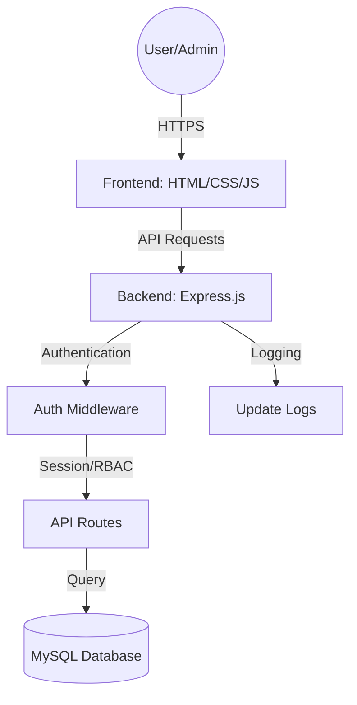

# 🚄 Railway Pro: Advanced Train Delay Management System

[](https://opensource.org/licenses/MIT)
[](https://nodejs.org/)
[](https://www.mysql.com/)
[](#)
[](#)

**Railway Pro** is a sophisticated, full-stack monitoring and analytics platform engineered for modern railway logistics. It empowers operators with real-time delay tracking, predictive performance insights, and a secure administration suite to streamline fleet operations.

---

## 💎 Premium Features

### 📊 Intelligence Dashboard
*   **Dynamic Analytics**: Real-time KPI tracking for On-Time Performance, Average Delay, and Volume.
*   **Visual Insights**: Interactive performance trends and delay distribution charts powered by **Chart.js**.
*   **Entity Ranking**: Instant identification of bottleneck stations and high-delay train routes.

### 🛡️ Secure RBAC System
*   **Administrator**: Full sovereignty over fleet data, station nodes, and system configurations.
*   **Station Manager**: Specialized access for log management, performance reporting, and data verification.
*   **Public Access**: Transparent, read-only dashboards for schedules and live status updates.

### ⚙️ Operational Excellence
*   **Quick-Add Dashboard**: A high-velocity interface for rapid data entry and schedule adjustments.
*   **Automated Logging**: Real-time tracking of data scraping cycles and system health.
*   **Professional Reporting**: Advanced CSV export capabilities for stakeholder presentations.

---

## 🏗️ System Architecture



### Directory Structure
```bash
├── backend/            # Express.js Server & REST API
│   ├── middleware/     # RBAC & Session Security
│   ├── routes/         # Modular API Endpoints
│   ├── db.js           # Database Connection Pool
│   └── server.js       # Main Application Entry
├── database/           # Persistent Storage Layer
│   └── schema.sql      # MySQL Schema & Initial Data
└── frontend/           # Premium User Interface
    ├── css/            # Custom Design System (Glassmorphism)
    ├── js/             # API Integration & Reactive Logic
    └── assets/         # High-Fidelity Media Assets
```

---

## 🛠️ Technical Stack

| Layer | Technology |
| :--- | :--- |
| **Frontend** | HTML5, CSS3 (Vanilla Design System), JavaScript (ES6+), Chart.js |
| **Backend** | Node.js, Express.js |
| **Database** | MySQL 8.0+ |
| **Security** | express-session, Role-Based Access Control (RBAC) |
| **Environment** | Dotenv, CORS |

---

## 🚀 Installation & Setup

### 1. Database Initialization
1. Create a database named `train_delay_management_system` in your MySQL instance.
2. Import the schema to build the structure:
   ```bash
   mysql -u your_user -p train_delay_management_system < database/schema.sql
   ```
3. Update credentials in `backend/db.js` or via environment variables.

### 2. Backend Configuration
```bash
cd backend
npm install
```

### 3. Execution
```bash
# Production Mode
npm start

# Development Mode (Requires nodemon)
npm run dev
```
The application will launch at [http://localhost:3000](http://localhost:3000).

### 🔑 Access Credentials
| Role | Identity | Passkey |
| :--- | :--- | :--- |
| **Admin** | `admin` | `admin123` |
| **Manager** | `manager` | `manager123` |
| **Public** | `user` | `user123` |

---

## 📡 REST API Reference

| Endpoint | Method | Role | Description |
| :--- | :--- | :--- | :--- |
| `/api/auth/login` | `POST` | Public | Session authentication |
| `/api/summary` | `GET` | Public | KPI & Dashboard metrics |
| `/api/trains` | `GET/POST/PUT` | Admin | Fleet management |
| `/api/stations` | `GET/POST` | Staff | Station node management |
| `/api/reports/trains` | `GET` | Staff | Export performance data |

---

## 📜 License
This project is licensed under the [MIT License](https://opensource.org/licenses/MIT).

_Crafted for precision, performance, and aesthetic excellence._
